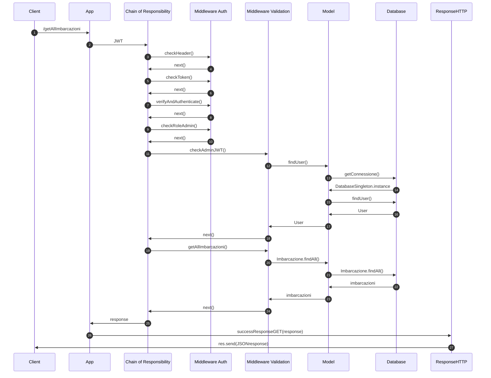
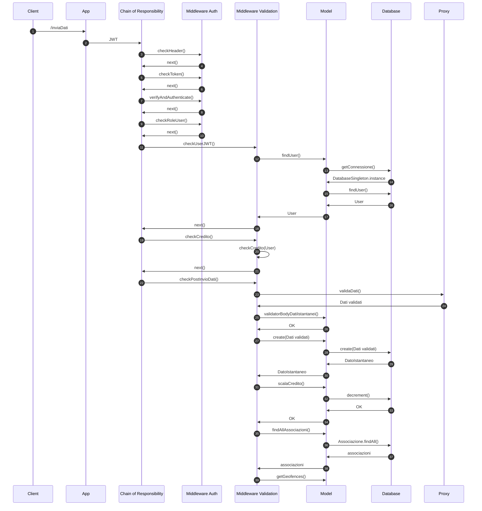

# Boats-Project

## Diagrammi UML
### Diagramma dei casi d'uso

### Diagrammi delle sequenze

### get All Imbarcazioni

### post Invio Dati Istantanei

### put Ricarica Utente

### delete Associazione
