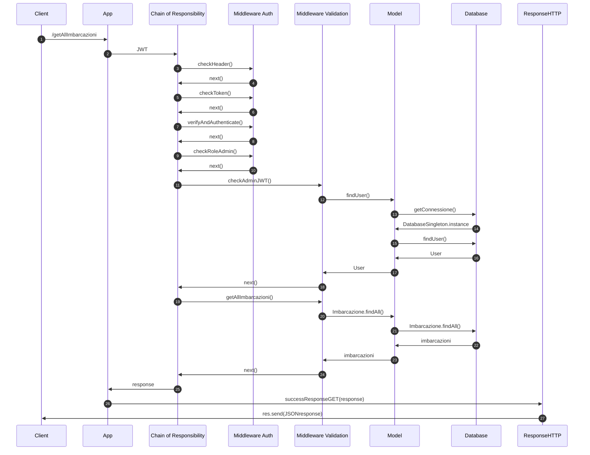
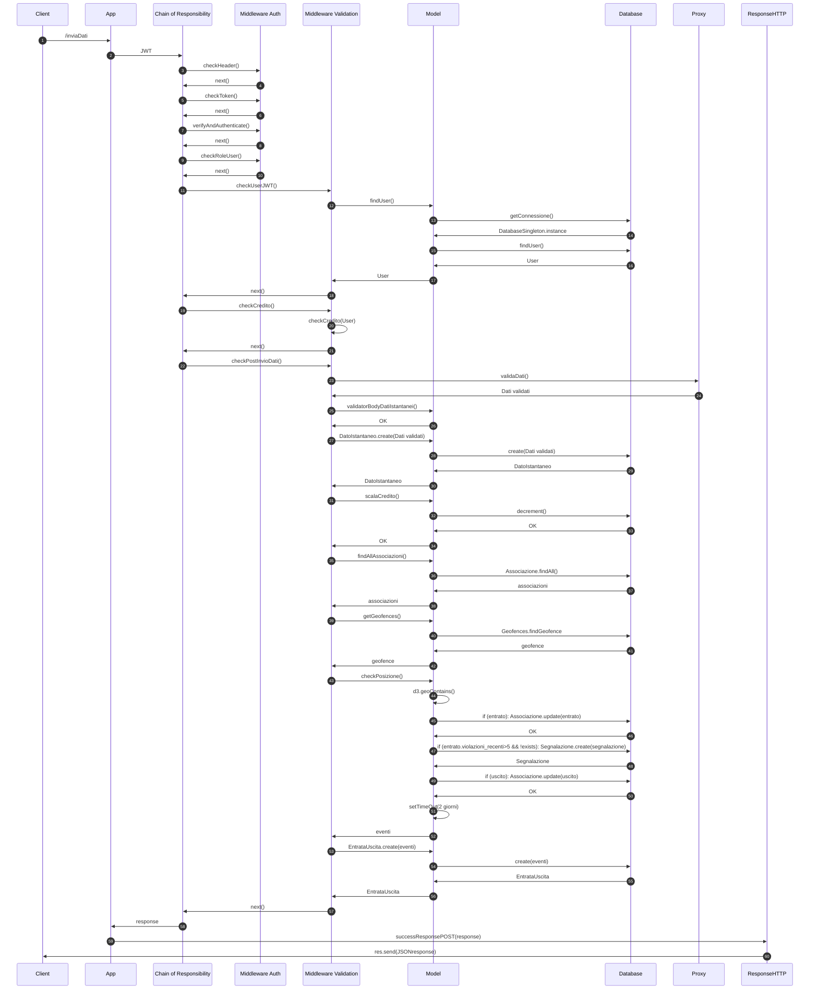
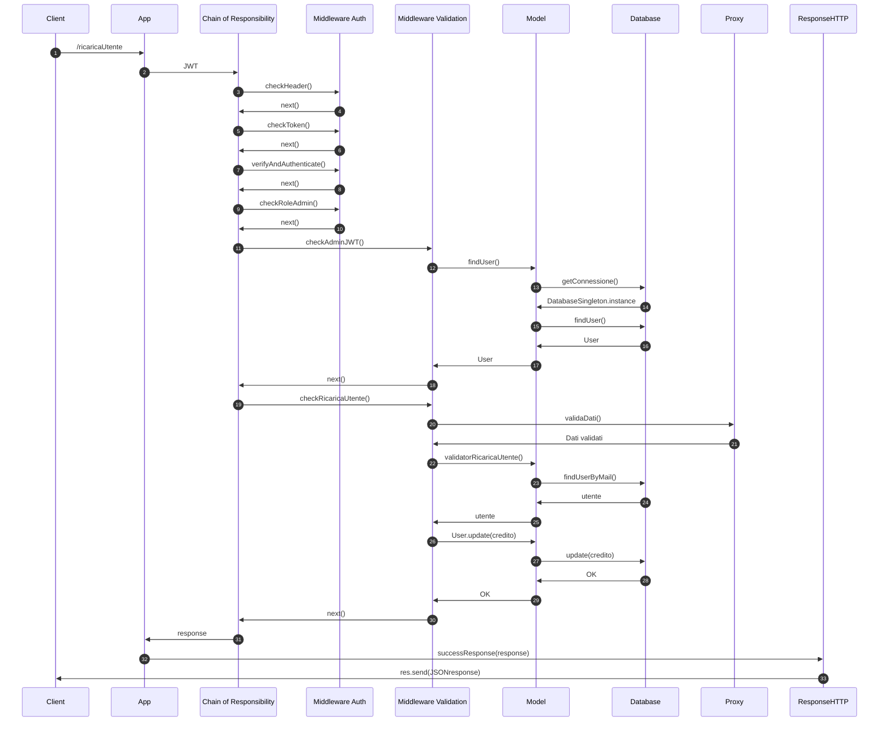
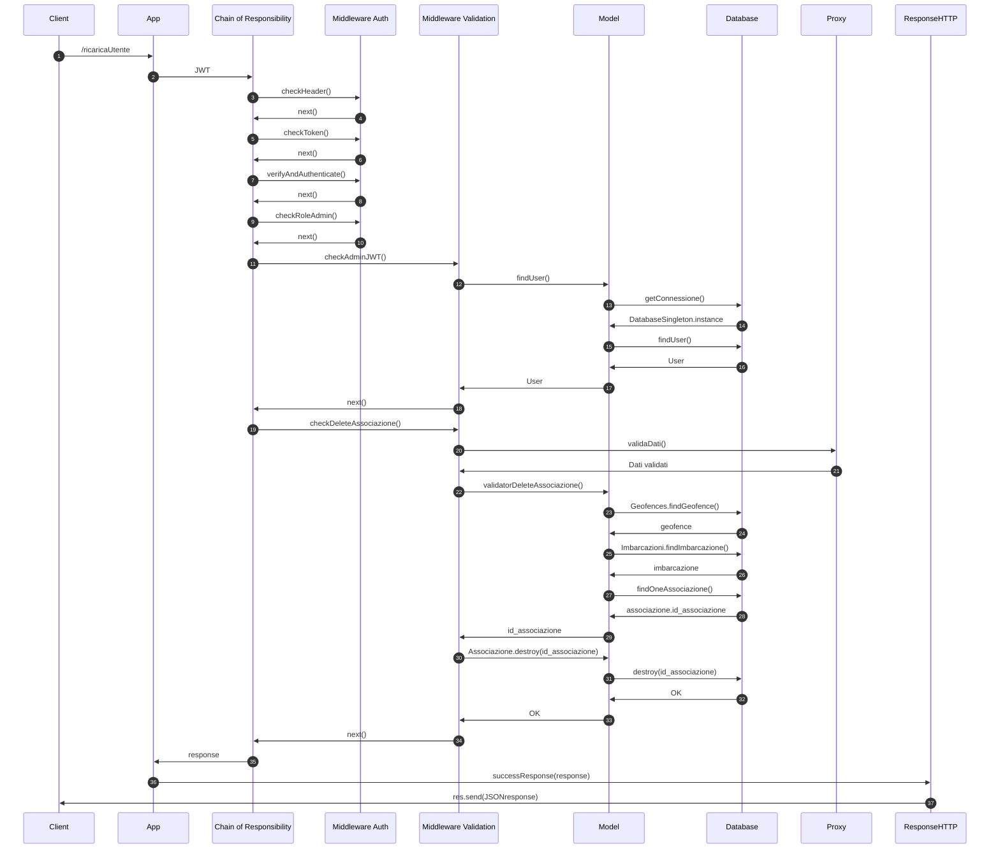

# Boats Project
## Descrizione del progetto
L'obiettivo è quello di realizzare un servizio di back-end che definisca delle aree geografiche marittime, denominate Geofence, in cui ogni ingresso e ogni uscita di imbarcazioni deve essere registrato. Ad ogni Geofence possono essere associate delle imbarcazioni, identificate tramite un mmsi (codice identificativo univoco). L'associazione è quella che abilita la memorizzazione degli eventi di entrata e uscita relativi all'imbarcazione e alla Geofence collegate dall'associazione stessa. Un ingresso in una geofence comporta un incremento unitario del numero di violazioni (se è passata più di un'ora dall'ultimo ingresso registrato nella stessa Geofence). Se il numero supera le 5 violazioni in un intervallo temporale di 48 ore, viene generata una segnalazione con stato "in corso" per quella associazione. La segnalazione rientra se, nelle successive 48 ore dall'ultima uscita dalla Geofence, non si commettono ulteriori violazioni di ingresso della geofence stessa. Il numero di violazioni aumenta anche se si supera il limite di velocità all'interno di una Geofence in cui questo limite è presente.

Sono stati previsti due ruoli distinti, ognuno con funzionalità dedicate.
#### Ruolo "admin"
Corrisponde all'amministratore di sistema. Può:
* Inserire nuove Geofence, nuove imbarcazioni, aggiungere e rimuovere associazioni.
* Visualizzare tutte le imbarcazioni, Geofences e associazioni registrate. 
* Visualizzare tutte le entrate e uscite registrate per tutte le associazioni.
* Visualizzare l'elenco di tutte le segnalazioni registrate(in corso e rientrate)
* Visualizzare tutte le posizioni di una determinata imbarcazione in uno specifico intervallo temporale 
* Visualizzare lo stato di tutte le imbarcazioni associate ad una determinata Geofence (con relativo tempo di permanenza in minuti per quelle all'interno). 
* Ricaricare il credito di un utente.

#### Ruolo "user"
Corrisponde all'utente proprietario di imbarcazioni. Può:
* Inviare i dati istantanei di una imbarcazione da lui posseduta (l'invio ha un costo di 0,025 token). 
* Visualizzare tutte le associazioni per le proprie imbarcazioni. 
* Visualizzare lo stato di tutte le proprie imbarcazioni associate a una determinata Geofence (con relativo tempo di permanenza in minuti per quelle all'interno) 
* Visualizzare l'elenco di tutte le segnalazioni registrare(in corso e rientrate)
* Visualizzare il proprio credito residuo.
## Rotte
Di seguito l'elenco delle rotte. Qualsiasi rotta non implementata restituisce l'error 404 NOT FOUND

|Tipo|Rotta|Ruolo|
|:---:|:---:|:---:|
|POST|[/creaImbarcazione](#inserimento-di-una-nuova-imbarcazione-creaimbarcazione)|Admin|
|POST|[/creaGeofence](#inserimento-di-una-nuova-geofence-creageofence)|Admin|
|POST|[/creaAssociazione](#inserimento-di-una-nuova-associazione-creaassociazione)|Admin|
|POST|[/inviaDati](#invio-di-dati-istantanei-inviadati)|User|
|PUT|[/ricaricaUtente](#ricarica-di-un-utente-ricaricautente)|Admin|
|DELETE|[/deleteAssociazione](#rimozione-di-unassociazione-deleteassociazione)|Admin|
|GET|[/getAllImbarcazioni](#visualizzazione-di-tutte-le-imbarcazioni-getallimbarcazioni)|Admin|
|GET|[/getAllGeofences](#visualizzazione-di-tutte-le-geofences-getallgeofences)|Admin|
|GET|[/getAllUsers](#visualizzazione-di-tutti-gli-utenti-getallusers)|Admin|
|GET|[/getAllAssociazioni](#visualizzazione-di-tutte-le-associazioni-getallassociazioni)|Admin|
|GET|[/getEntrateUscite](#visualizzazione-di-tutte-le-entrate-e-uscite-getentrateuscite)|Admin|
|GET|[/getStatoImbarcazioni/:geofence](#visualizzazione-dello-stato-di-tutte-le-imbarcazioni-associate-a-una-geofence-getstatoimbarcazionigeofence)|Admin|
|GET|[/getPosizioni/:mmsi/:dataInizio/:dataFine ](#visualizzazione-delle-posizioni-di-una-imbarcazione-in-un-intervallo-temporale-getposizionimmsidatainiziodatafine)|Admin|
|GET|[/getSegnalazioni](#visualizzazione-di-tutte-le-segnalazioni-getsegnalazioni)|Admin/User|
|GET|[/getStatoImbarcazioniUser/:geofence ](#visualizzazione-dello-stato-di-tutte-le-imbarcazioni-di-un-utente-associate-a-una-geofence-getstatoimbarcazioniusergeofence)|User|
|GET|[/getAssociazioni](#visualizzazione-di-tutte-le-associazioni-di-imbarcazioni-possedute-da-un-utente-getassociazioni)|User|
|GET|[/getCredito](#visualizzazione-del-credito-di-un-utente-getcredito)|User|

 ### Autenticazione tramite JWT
 Tutte le rotte implementate richiedono che l'utente specifichi un token JWT valido nella richiesta. I token JWT possono essere generati tramite il seguente sito:
[JWT.IO](https://jwt.io/), tramite la chiave *mysupersecretkeyboat*.

Il payload del JWT deve contenere i campi "username" e "ruolo". Questi valori vengono confrontati e validati se corrispondono a quelli presenti nel Database.

Di seguito un JWT valido per l'utente con username admin e ruolo admin
~~~
{
    "username":"admin",
    "ruolo":"admin"
}
~~~
Per quanto riguarda il ruolo "user", un JWT valido sarà del tipo:
~~~
{
    "username":"mario_rossi",
    "ruolo":"user"
}
~~~
  ### Rotte Admin
 Per avere l'autorizzazione a chiamare le rotte admin, c'è bisogno di utilizzare un JWT che abbia specificato come ruolo 'admin'.
 Di seguito verranno descritte in dettaglio tutte le rotte previste per questo ruolo. Verrà dato per scontato il fatto di aver inserito nella richiesta un JWT valido.
 
#### Inserimento di una nuova imbarcazione (/creaImbarcazione)
Questa rotta permette di inserire una nuova imbarcazione.

I dati dell'imbarcazione devono essere inseriti nel body della richiesta in formato JSON con la seguente struttura:

* "mmsi": Identificativo univoco dell'imbarcazione. È costituito da 9 cifre.
* "proprietario": Username del proprietario dell'imbarcazione. Deve esistere nella tabella users.
* "nome_imbarcazione": Nome dell'imbarcazione da inserire.
* "lunghezza": Lunghezza in metri dell'imbarcazione da inserire
* "peso": Peso in kg dell'imbarcazione da inserire

Di seguito un esempio di body della richiesta valido:
~~~
{
    "mmsi": 123456987,
    "proprietario": "mario_rossi",
    "nome_imbarcazione": "Nina",
    "lunghezza": 20,
    "peso": 1000
}
~~~

#### Inserimento di una nuova Geofence (/creaGeofence)
Questa rotta permette di inserire una nuova Geofence Area.

I dati della Geofence devono essere inseriti nel body della richiesta in formato JSON con la seguente struttura:

* "nome_area": Identificativo univoco della Geofence.
* "coordinate": Coordinate della geofence in formato [longitudine,latitudine]. Devono costituire un poligono chiuso. Per questo motivo, la prima coppia di coordinate deve essere uguale all'ultima e devono essere inserite almeno 4 coppie. Il tutto deve essere racchiuso tra parentesi quadre, per rispettare il formato GeoJSON. Nell'inserimento delle coordinate va seguito il verso orario.
* "vel_max": Parametro opzionale che, se specificato, imposta il limite di velocità all'interno della nuova Geofence.

Di seguito un esempio di body della richiesta valido:
~~~
{
    "nome_area": "Magnolia",
    "coordinate": [
                    [ [90.0, 0.0], [90.0, 20.0], [120.0, 20.0],
                    [120.0, 0.0], [90.0, 0.0] ]
                ],
    "vel_max": 50
}
~~~

#### Inserimento di una nuova Associazione (/creaAssociazione)
Questa rotta, di tipo POST, permette di inserire una nuova Associazione tra una Geofence e un'imbarcazione.

I dati della nuova Associazione devono essere inseriti nel body della richiesta in formato JSON con la seguente struttura:

* "nome_geofence": Identificativo univoco della Geofence. Deve esistere nel Database.
* "mmsi_imbarcazione": mmsi: Identificativo univoco dell'imbarcazione. È costituito da 9 cifre. Deve esistere nel Database.

Di seguito un esempio di body della richiesta valido:
~~~
{
    "nome_geofence": "Gotham",
    "mmsi_imbarcazione": 123456798
}
~~~

#### Ricarica di un utente (/ricaricaUtente)
Questa rotta, di tipo PUT, permette di impostare il nuovo credito di un utente identificato tramite mail.

I dati della ricarica devono essere inseriti nel body della richiesta in formato JSON con la seguente struttura:

* "mail": Mail dell'utente a cui ricaricare il credito. Deve corrispondere a un utente esistente.
* "credito": Nuovo credito dell'utente in token.

Di seguito un esempio di body della richiesta valido:
~~~
{
    "mail": "mario@rossi.com",
    "credito": 1100
}
~~~

#### Rimozione di un'associazione (/deleteAssociazione)
Questa rotta, di tipo DELETE, permette di rimuovere un'associazione esistente tra una imbarcazione e una geofence.

I dati della ricarica devono essere inseriti nel body della richiesta in formato JSON con la seguente struttura:

* "nome_geofence": Identificativo univoco della Geofence. Deve esistere nel Database.
* "mmsi_imbarcazione": mmsi: Identificativo univoco dell'imbarcazione. È costituito da 9 cifre. Deve esistere nel Database.

Di seguito un esempio di body della richiesta valido:
~~~
{
    "nome_geofence": "Gotham",
    "mmsi_imbarcazione": 123456789
}
~~~

#### Visualizzazione di tutte le imbarcazioni (/getAllImbarcazioni)
Questa rotta, di tipo GET, permette di visualizzare i metadati di tutte le imbarcazioni presenti nel Database.

#### Visualizzazione di tutte le Geofences (/getAllGeofences)
Rotta di tipo GET che permette di visualizzare i metadati di tutte le geofences presenti nel Database.

#### Visualizzazione di tutti gli utenti (/getAllUsers)
Rotta di tipo GET che permette di visualizzare tutti gli utenti presenti nel Database con i loro usernames, ruoli, mail e crediti.

#### Visualizzazione di tutte le associazioni (/getAllAssociazioni)
Rotta di tipo GET che permette di visualizzare tutti le associazioni tra imbarcazioni e Geofences presenti nel Database.

#### Visualizzazione di tutte le entrate e uscite (/getEntrateUscite)
Rotta di tipo GET che permette di visualizzare tutti gli eventi di entrata e uscita di ogni associazione registrati nel Database attraverso l'invio di dati istantanei degli utenti.

#### Visualizzazione dello stato di tutte le imbarcazioni associate a una Geofence (/getStatoImbarcazioni/:geofence)
Rotta di tipo GET che permette di visualizzare lo stato  di tutte le imbarcazioni in una Geofence prestabilita. Si deve inserire come parametro il nome della Geofence. Un esempio di rotta valida è:
~~~
/getStatoImbarcazioni/Gotham
~~~

#### Visualizzazione delle posizioni di una imbarcazione in un intervallo temporale (/getPosizioni/:mmsi/:dataInizio/:dataFine)
Rotta di tipo GET che permette di visualizzare la posizione di una imbarcazione in un determinato intervallo temporale. I parametri da inserire nella rotta sono: 
*mmsi imbarcazione: Identificativo univoco dell'imbarcazione di cui visualizzare le posizioni. È costituito da 9 cifre.
*data di inizio: Data di inizio dell'intervallo temporale da considerare.
*data di fine. Data di inizio dell'intervallo temporale da considerare. Se non specificata, verranno filtrate le posizioni fino alla data corrente.

 Per le date, il formato accettato è YYYY-MM-DD.

Di seguito un esempio di rotta valida:
~~~
/getPosizioni/123456789/2022-07-01/2022-07-14
~~~
### Rotte Admin/User
#### Visualizzazione di tutte le segnalazioni (/getSegnalazioni)
Rotta di tipo GET che permette di visualizzare tutte le segnalazioni registrate con il relativo stato (in corso o rientrata).

### Rotte User
 Per avere l'autorizzazione a chiamare le rotte user, c'è bisogno di utilizzare un JWT che abbia specificato come ruolo 'user'.
 Di seguito verranno descritte in dettaglio tutte le rotte previste per questo ruolo. Verrà dato per scontato il fatto di aver inserito nella richiesta un JWT valido.
#### Invio di dati istantanei (/inviaDati)
Questa rotta permette di inviare i dati istantanei relativi ad una imbarcazione. L'invio ha un costo di 0,025 token; l'utente deve possedere credito sufficiente, altrimenti si verrà visto recapitare il messaggio di errore 401 Unauthorized. La posizione inviata viene valutata per tutte le associazioni dell'imbarcazione e vengono registrate eventuali entrate o uscite dalle Geofences associate. Inoltre, un ingresso in una geofence comporta un incremento unitario del numero di violazioni (se è passata più di un'ora dall'ultimo ingresso registrato nella stessa Geofence). Se queste superano le 5 violazioni in un intervallo temporale di 48 ore, viene generata una segnalazione con stato "in corso" per quella associazione. La segnalazione rientra se, nelle successive 48 ore dall'ultima uscita dalla geofence, non si commettono ulteriori violazioni di ingresso della geofence stessa. Il numero di violazioni aumenta anche se si supera il limite di velocità all'interno di una Geofence in cui questo limite è presente.

I dati istantanei devono essere inseriti nel body della richiesta in formato JSON con la seguente struttura:

* "mmsi": Identificativo univoco dell'imbarcazione. È costituito da 9 cifre. Deve corrispondere ad una imbarcazione posseduta dall'utente che invia i dati.
* "longitudine": Valore in gradi decimali(DD) della longitudine della posizione inviata. Deve essere compreso tra -180° e 180°.
* "latitudine": Valore in gradi decimali(DD) della latitudine della posizione inviata. Deve essere compreso tra -90 e 90°.
* "stato": Stato dell'imbarcazione al momento dell'invio dei dati istantanei. Può essere uno tra "in navigazione", "in pesca" o "stazionaria".
* "velocità": Velocità in km/h dell'imbarcazione al momento dell'invio dei dati istntanei.

Di seguito un esempio di body della richiesta valido:
~~~
{
    "mmsi": 123456789,
    "longitudine": 10,
    "latitudine": 10,
    "stato": "in navigazione",
    "velocità": 60
}
~~~
In questo esempio, longitudine e latitudine corrispondono a 10.000000°, in modo da essere identificate come coordinate valide.
#### Visualizzazione dello stato di tutte le imbarcazioni di un utente associate a una geofence (/getStatoImbarcazioniUser/:geofence)
Rotta di tipo GET che permette di visualizzare se le proprie imbarcazioni si trovino all'interno o all'esterno di una determinata Geofence e, per quelle che si trovano all'interno, il tempo di permanenza in essa in minuti. Si deve inserire come parametro il nome della Geofence. 

Di seguito un esempio di rotta valida: 
~~~
/getStatoImbarcazioniUser/Gotham
~~~

#### Visualizzazione di tutte le associazioni di imbarcazioni possedute da un utente (/getAssociazioni)
Rotta di tipo GET che permette di visualizzare l'elenco delle associazioni tra le imbarcazioni possedute dall'utente che fa la richiesta e le Geofences a loro associate.

#### Visualizzazione del credito di un utente (/getCredito)
Rotta di tipo GET che permette di visualizzare il proprio credito.

## Diagrammi UML

### Diagramma dei casi d'uso
#### Diagramma dei casi d'uso dell'utente con ruolo Admin

#### Diagramma dei casi d'uso dell'utente con ruolo User

### Diagrammi delle sequenze
Di seguito vengono riportati i diagrammi delle sequenze di alcune delle operazioni più interessanti, uno per tipo di richiesta HTTP.
#### GET All Imbarcazioni

#### POST Invio Dati Istantanei

#### PUT Ricarica Utente

#### DELETE Associazione

