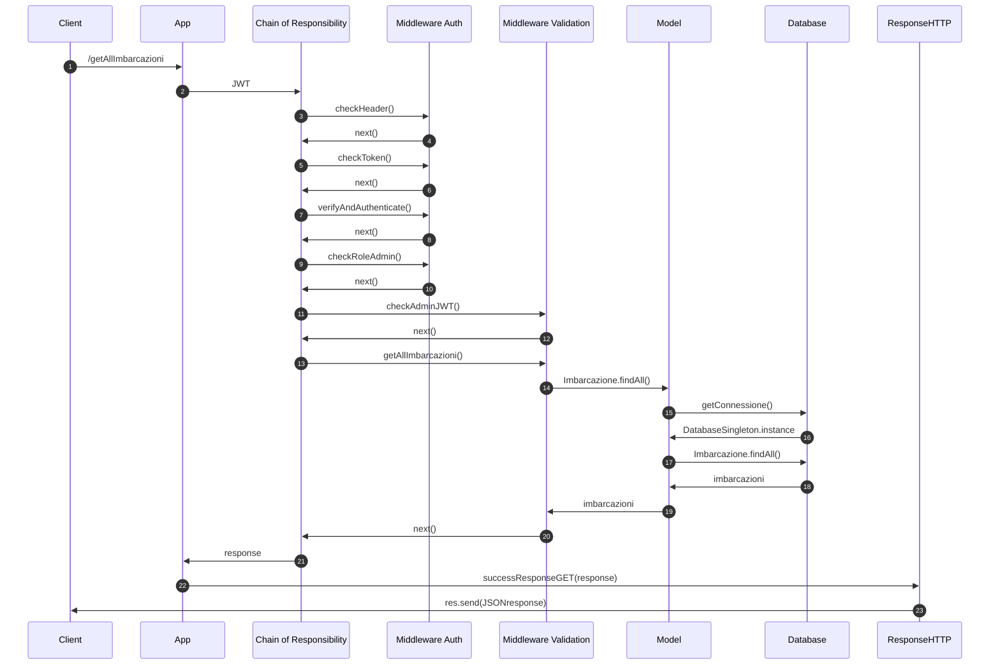

# Boats-Project

## Diagrammi UML
### Diagramma dei casi d'uso

### Diagrammi delle sequenze

### get All Imbarcazioni



### post Invio Dati Istantanei

```mermaid
sequenceDiagram
autonumber

```

### put Ricarica Utente


### delete Associazione
