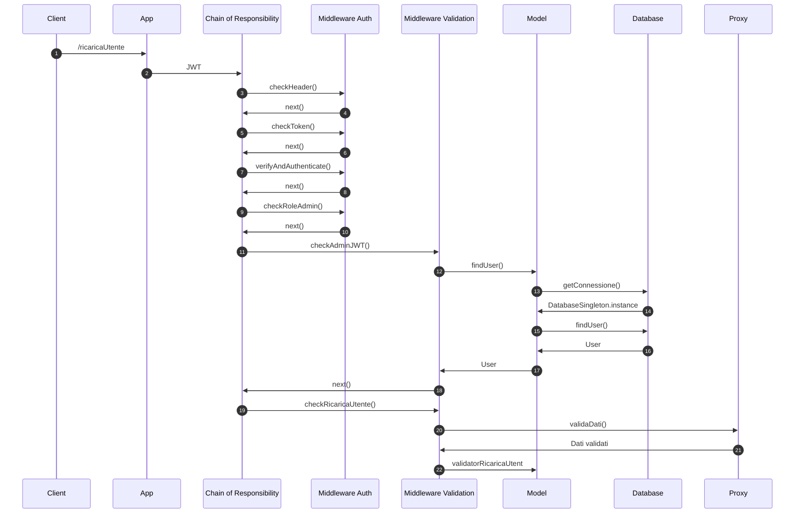
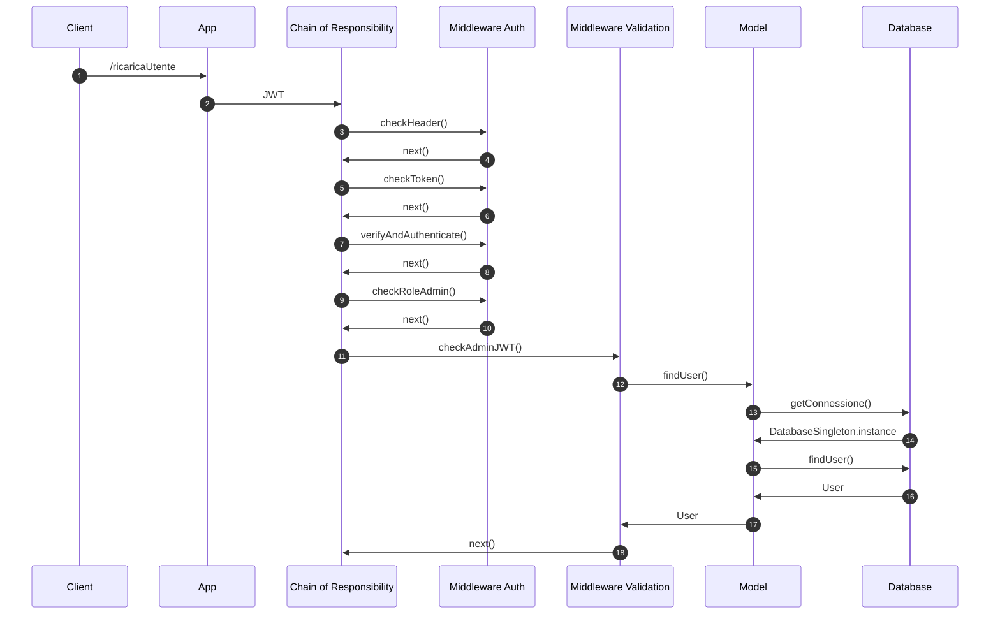

# Boats-Project
## Rotte
Di seguito l'elenco delle rotte. Qualsiasi rotta non implementata restituisce l'error 404 NOT FOUND

<table align="center">
    <thead>
        <tr>
            <th>Tipo</th>
            <th>Rotta</th>
            <th>Ruolo</th>
        </tr>
    </thead>
    <tbody>
        <tr>
         <td> POST </td>
         <td> /creaImbarcazione </td>
         <td> Admin </td>
        </tr>
        <tr>
         <td> POST </td>
         <td> /creaGeofence </td>
         <td> Admin </td>
        </tr>
        <tr>
         <td> POST </td>
         <td> /creaAssociazione </td>
         <td> Admin </td>
        </tr>
        <tr>
         <td> POST </td>
         <td> /creaAssociazione </td>
         <td> Admin </td>
        </tr>
      <tr>
         <td> POST </td>
         <td> /inviaDati </td>
         <td> User </td>
        </tr>
        <tr>
         <td> PUT </td>
         <td> /ricaricaUtente </td>
         <td> Admin </td>
        </tr>
        <tr>
         <td> DELETE </td>
         <td> /deleteAssociazione </td>
         <td> Admin </td>
        </tr>
        <tr>
         <td> GET </td>
         <td> /getAllImbarcazioni </td>
         <td> Admin </td>
        </tr>
        <tr>
         <td> GET </td>
         <td> /getAllGeofences </td>
         <td> Admin </td>
        </tr>
        <tr>
         <td> GET </td>
         <td> /getAllUsers </td>
         <td> Admin </td>
        </tr>
        <tr>
         <td> GET </td>
         <td> /getAllAssociazioni </td>
         <td> Admin </td>
        </tr>
        <tr>
         <td> GET </td>
         <td> /getEntrateUscite </td>
         <td> Admin </td>
        </tr>
        <tr>
         <td> GET </td>
         <td> /getStatoImbarcazioni/:geofence </td>
         <td> Admin </td>
        </tr>
        <tr>
         <td> GET </td>
         <td> /getPosizioni/:mmsi/:dataInizio/:dataFine </td>
         <td> Admin </td>
        </tr>
        <tr>
         <td> GET </td>
         <td> /getSegnalazioni </td>
         <td> Admin </td>
        </tr>
        <tr>
         <td> GET </td>
         <td> /getStatoImbarcazioniUser/:geofence </td>
         <td> User </td>
        </tr>
        <tr>
         <td> GET </td>
         <td> /getAssociazioni </td>
         <td> User </td>
        </tr>
        <tr>
         <td> GET </td>
         <td> /getCredito </td>
         <td> User </td>
        </tr>
    </tbody>
 </table>
 
 ### Autenticazione tramite JWT
 Tutte le rotte implementate richiedono che l'utente specifichi un token JWT valido nella richiesta. I token JWT possono essere generati tramite il seguente sito:
[JWT.IO](https://jwt.io/), tramite la chiave *'mysupersecretkeyboat'*.

Il payload del JWT deve contenere i campi "username" e "ruolo". Questi valori vengono confrontati e validati se corrispondono a quelli presenti nel Database.

Di seguito un JWT valido per l'utente con username admin e ruolo admin
~~~
{
    "username":"admin",
    "ruolo":"admin"
}
~~~
Per quanto riguarda il ruolo "user", un JWT valido sarà del tipo:
~~~
{
    "username":"mario_rossi",
    "ruolo":"user"
}
~~~
 ### Rotte Admin
 Per avere l'autorizzazione a chiamare le rotte admin, c'è bisogno di utilizzare un JWT che abbia specificato come ruolo 'admin'.
 Di seguito verranno descritte in dettaglio tutte le rotte previste per questo ruolo. Verrà dato per scontato il fatto di aver inserito nella richiesta un JWT valido.
#### Inserimento di una nuova imbarcazione (/creaImbarcazione)
Questa rotta permette di inserire una nuova imbarcazione.

I dati dell'imbarcazione devono essere inseriti nel body della richiesta in formato JSON con la seguente struttura:

* "mmsi": Identificativo univoco dell'imbarcazione. È costituito da 9 cifre.
* "proprietario": Username del proprietario dell'imbarcazione. Deve esistere nella tabella users.
* "nome_imbarcazione": Nome dell'imbarcazione da inserire.
* "lunghezza": Lunghezza in metri dell'imbarcazione da inserire
* "peso": Peso in kg dell'imbarcazione da inserire

Di seguito un esempio di body della richiesta valido:
~~~
{
    "mmsi": 123456987,
    "proprietario": "mario_rossi",
    "nome_imbarcazione": "Nina",
    "lunghezza": 20,
    "peso": 1000
}
~~~
#### Inserimento di una nuova Geofence (/creaGeofence)
Questa rotta permette di inserire una nuova Geofence Area.

I dati della Geofence devono essere inseriti nel body della richiesta in formato JSON con la seguente struttura:

* "nome_area": Identificativo univoco della Geofence.
* "coordinate": Coordinate della geofence in formato [longitudine,latitudine]. Devono costituire un poligono chiuso. Per questo motivo, la prima coppia di coordinate deve essere uguale all'ultima e devono essere inserite almeno 4 coppie. Il tutto deve essere racchiuso tra parentesi quadre, per rispettare il formato GeoJSON. Nell'inserimento delle coordinate va seguito il verso orario.
* "vel_max": Parametro opzionale che, se specificato, imposta il limite di velocità all'interno della nuova Geofence.

Di seguito un esempio di body della richiesta valido:
~~~
{
    "nome_area": "Magnolia",
    "coordinate": [
                    [ [90.0, 0.0], [90.0, 20.0], [120.0, 20.0],
                    [120.0, 0.0], [90.0, 0.0] ]
                ],
    "vel_max": 50
}
~~~
## Diagrammi UML

### Diagramma dei casi d'uso

### Diagrammi delle sequenze

### get All Imbarcazioni

### post Invio Dati Istantanei

### put Ricarica Utente

### delete Associazione

